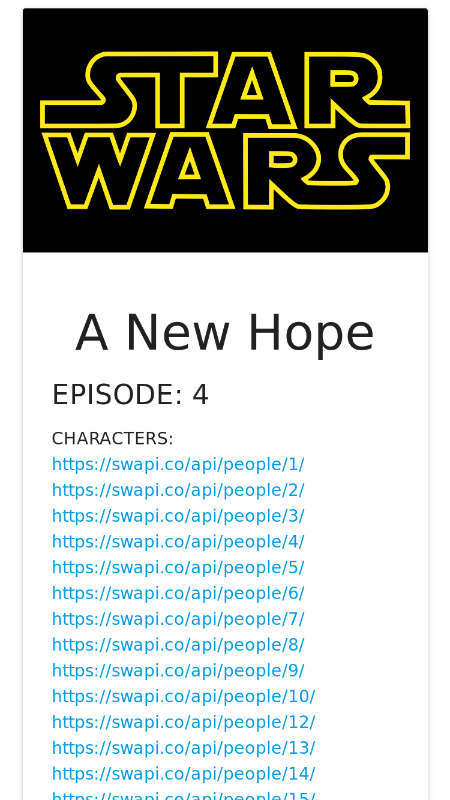
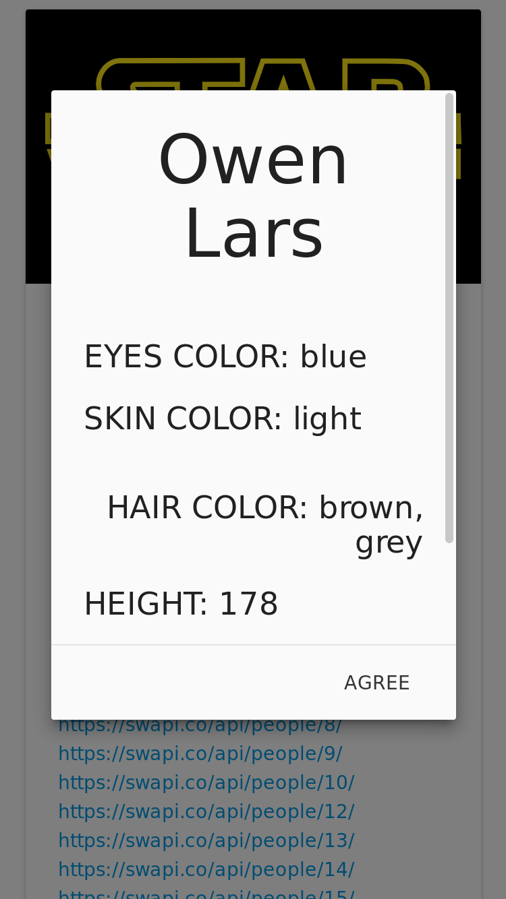

# App de Star Wars

* **Track:** _Common Core_
* **Empresa:** _Laboratoria_
* **Enlace:** [Enlace al proyecto](https://superliza.github.io/swapi/)

---

Muestra un listado con los personajes de la saga de películas Star Wars dividido en secciones que representan los diversos episodios de la serie.

Se hacen peticiones a la base de Datos de Star Wars usando la API.

**Se utilizaron las siguientes tecnologías:**

* `JavaScript`: Lenguaje de programación usado del lado del cliente.
* `jQuery`: Biblioteca de JavaScript usada para manipular el árbol DOM.
* `AJAX`: Técnica de desarrollo usada para crear una aplicación interactiva.
* `Materialize`: Framework responsivo de CSS basado en Material Design.
* `SWAPI`: API de Star Wars usada para obtener la información de los personajes.
* `CSS`: Lenguaje de diseño usado para definir la presentación de la página.
* `HTML5`: Lenguaje de marcado usado para crear la estructura de la página.

---

# Capturas:

